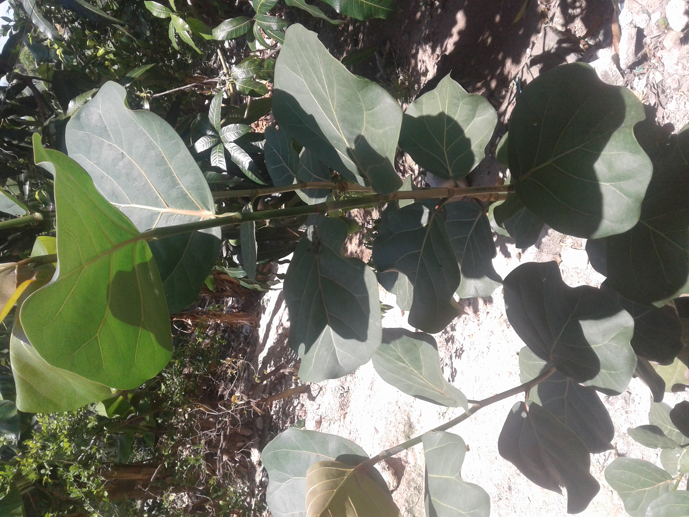
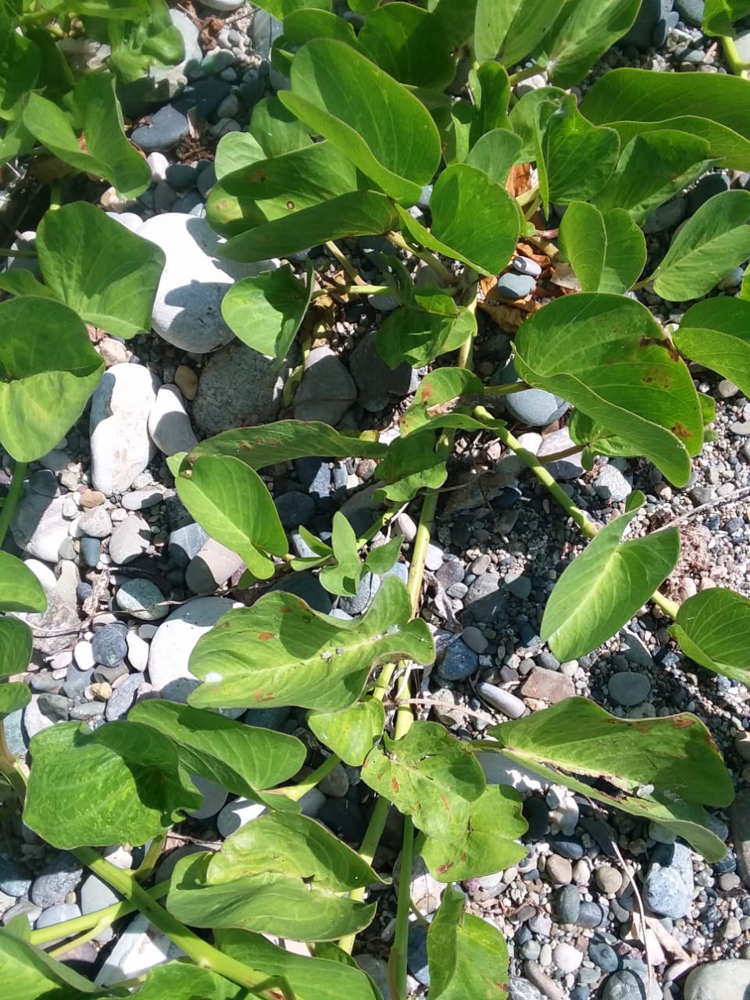
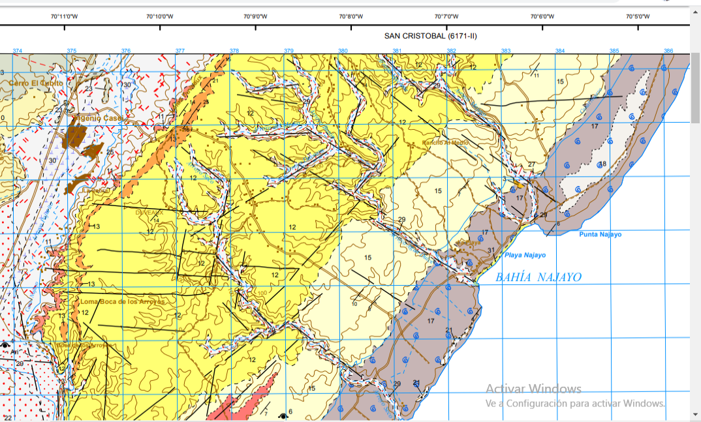

# Introducción

El mar constituye un elemento fundamental del conjunto de elementos de la superficie terrestre capaz de generar cambios en las líneas de costas, sean estas en una isla o continente. De acuerdo con @suarez1999delimitacion, el termino costa se puede aludir a la franja de tierra que bordea el mar o a la zona de contacto entre el medio marino y el medio terrestre. Teniendo en cuenta que la línea de costa puede variar en un instante, por el paso de los años por la dinámica litoral o por causa de fenomenos naturales, que pueden traer como posible concecuencia la erosión o regresión de la costa.

Para @kokot2004erosion, la erosión costera es el resultado de un exceso de remoción de sedimentos respecto del aporte suministrado al área en un determinado periodo. La misma abarca la emersión y sumersión de sedimentos en las orillas del mar o la playa, lo que mantiene en constante movimiento el límite exacto de un verdadero perfil de costa. Numerosos autores se han dedicado al estudio del análisis de cambio de perfil de costa, usando como fuentes imágenes satelitales o fotografías áereas históricas de la zona de estudio, además de hacer observaciones y mediciones por un periodo de tiempo determinado que puedan dar respuesta a dicho cambio o proceso; como es el caso de [@hernandez2008morfodinamica].

La costa como unidad geomorfológica se mantiene en constante estado de evolución. La importancia de conocer hacia dónde se desplaza más y que forma ésta va adquiriendo, permite diferenciar el tipo de costa que, de acuerdo con @codignotto1997geomorfologia, pueden dividirse en: costa en progradación, costa estacionaria y costa en retrogradación. Del mismo modo, el autor hace énfasis en la importancia de comprender los factores que iniciden en este proceso y las causas que lo producen.

De acuerdo con [@aliotta2009origen], las rocas o beach rock son formaciones sedimentológicas comunes que evidencian un proceso erosivo del litoral, los cuales se dieron lugar en un ambiente geoquímico que enmarcó un periodo de evolución continuo que pudo abarcar varias etapas del tiempo geológico. Dónde en tal proceso la arena pudo ser compactada por medio de cemento carbonático y al pasar varias épocas posiblemete afloraron. En la isla de Santo Domingo las formaciones arrecifales o rocas de playas datan del Neógeno y el periodo cuaternario. Ejemplo según @sanmapa, la Fm. Isabela del pleistoceno; formación carbonatada arrecifal, rica en corales de tallas variables. Aflora bajo la forma de diferentes relieves, formando arrecifes en escalera descendiendo hacia el mar.

El litoral costero de la zona sur del país se caracteriza por pequeños acantilados, playas de origen aluvial y dunas extensas [@abreu1999impacto], además, mareas con oleajes extremos típico del mar caribe. No obstante, la ecología actúa como componentge categorico en el microclima de una zona, resultado de la diversidad que ésta puede aportar. Por tal motivo, el interés de conocer el tipo de vegetación. Razón de que estos, sobre la arena son preciso para la conservación de los sedimentos a concecuencia de la erosión del viento y la lluvia.

Según [@camara1997republica], los litorales de la isla, se caracterizan por tener flores propias de la especie árboreas o herbáceas como la la coccoloba_uvífera (uvas de playas), (ver figura \ref{coccoloba}) y la IPomoea_Pescaprea  (ver figura \ref{ipomoea}). De igual modo la vegetación cercanas a aguas dulce o salada suele llamarse bosques de manglares, estos suelen encontrarse en algunas dunas costeras de la parte sur del país, principalmente en las riveras y desembocaduras de cuencas lacustre. Conforme @polania1998manejo, estos tipos de bosques son asociaciones vegetales que prosperan en las costas tropicales y subtropicales del mundo. Pero en la isla de Santo Domingo existe una tipología diferente en dichos espacios costeros.

La playa de Najayo se encuentra ubicada en la sección del mismo nombre, perteneciente al municipio San Gregorio de Nigua, provincia San Cristobal, al Sur de la Republica Dominicana. Fisiográficamente, se ubica en la llanura costera del Caribe, en las coordenadas aproximadas 18º17'40" latitud Norte y 70º06'02" longitud Oeste. De acuerdo al mapa geológico de la isla de Santo Domingo [@abad2007mapageonizao], se estima que la formación del relieve costero de Najayo data de la era Cenozoica periodo Cuaternario entre las época Eoceno-Mioceno, el mismo está compuesto por arena y gravas bioclásticas formando el cordón litoral, además de conglomerado, gravas, arenas de fondo de valle, calizas arrecifales, calciruditas y calcarenitas (ver figura \ref{mapageo50k}).

\ldots

# Metodología

\ldots

# Resultados

\ldots

# Discusión

# Agradecimientos

# Información de soporte

\ldots

# *Script* reproducible

\ldots

# Referencias
