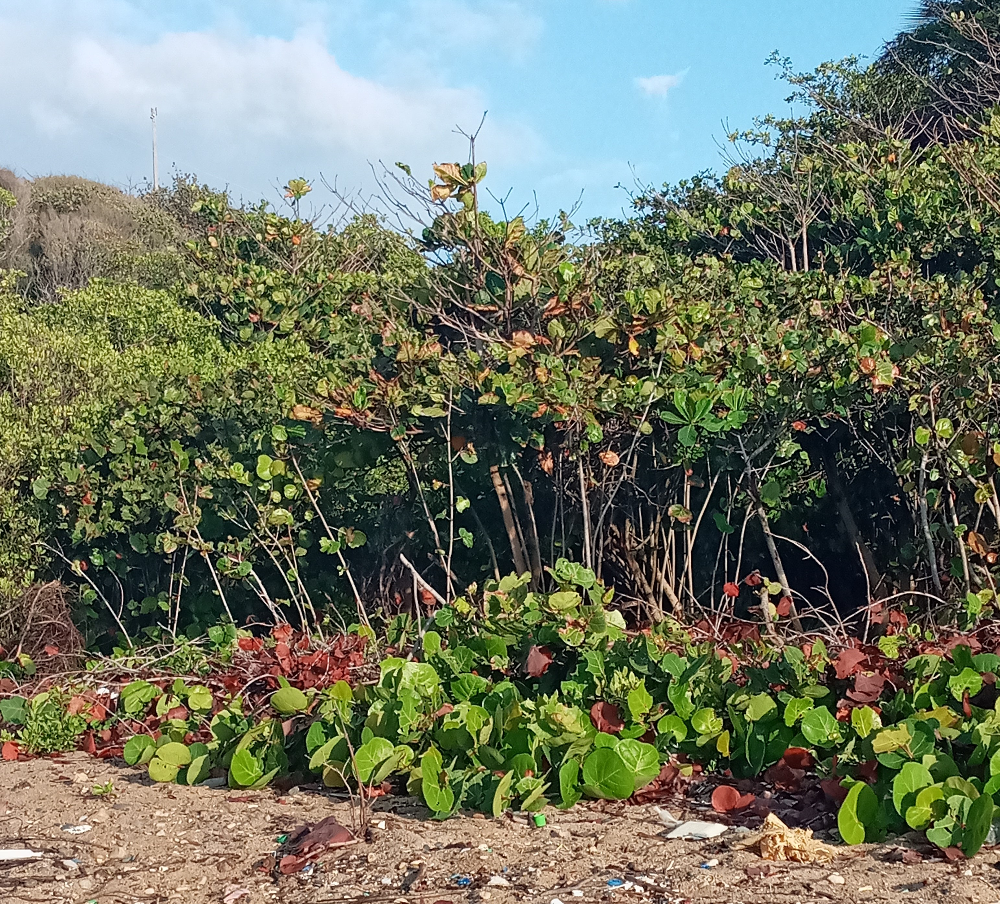
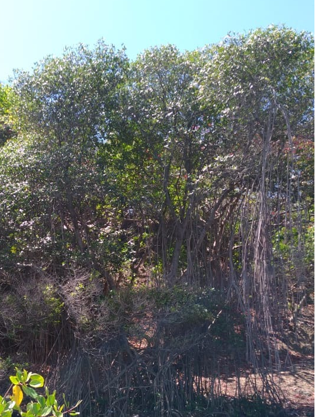
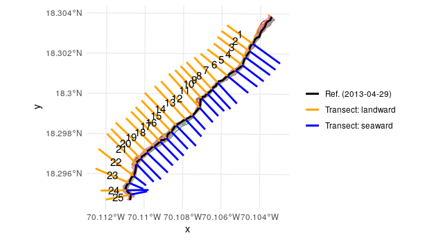
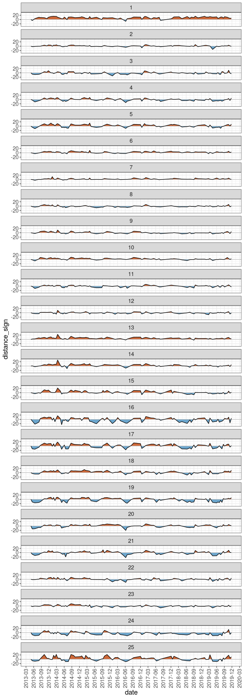

# Introducción

El mar constituye un elemento fundamental del conjunto de componentes de la superficie terrestre, capaz de generar cambios en las líneas de costas, sean estas en una isla o continente de acuerdo con [@kokot2004vulnerabilidad]. Para @suarez1999delimitacion, el término costa puede aludir a la franja de tierra que bordea el mar o a la zona de contacto entre el medio marino y el medio terrestre. Teniendo en cuenta que la línea de costa puede variar en un instante, o con el paso de los años, ya sea por la dinámica litoral o por causa de fenomenos naturales, que pueden traer como posible concecuencia la erosión o regresión de la costa [@kokot2004erosion;@codignotto1997geomorfologia].

Para @kokot2004erosion, la erosión costera es el resultado de un exceso de remoción de sedimentos respecto del aporte suministrado a un área determinada en un periodo específico. La misma abarca la emersión y sumersión de sedimentos en las orillas del mar o la playa, lo que mantiene en constante movimiento el límite exacto de la costa. Varios autores se han dedicado al análisis de línea de costa, usando como fuentes imágenes satélitales o fotografías áereas históricas. También se realizan observaciones y mediciones por un periodo de tiempo determinado que puedan dar respuesta a las causas de dicho cambio [@hernandez2008morfodinamica;@esquer2018modificacion;@cervantes2009variacion].

La costa como unidad geomorfológica se mantiene en constante estado de evolución. La importancia de conocer hacia dónde se desplaza más y qué forma ésta va adquiriendo, permite diferenciar el tipo de costa que, de acuerdo con @codignotto1997geomorfologia, puede clasificarse como: costa en progradación, costa estacionaria y costa en retrogradación. Del mismo modo, el autor hace énfasis en la importancia de comprender los factores que iniciden en este proceso y las causas que lo producen. Además de incluir posibles formaciones geoquimicas que se pueden producir en la zona producto de estos cambios, como es el caso de la roca de playa. 

De acuerdo con @aliotta2009origen, las rocas o *beachrock* son formaciones sedimentológicas comunes que evidencian un proceso erosivo del litoral, los cuales se dieron lugar en un ambiente geoquímico que enmarcó un periodo de evolución continua que pudo abarcar varias etapas del tiempo geológico. Es posible que durante ese proceso la arena de la playa compactara por medio de cemento carbonático y al pasar varias épocas posiblemete afloraron. En la isla de Santo Domingo las formaciones arrecifales o rocas de playas datan del Neógeno y el periodo cuaternario. Ejemplo de ella según @maparecursosminerales, la Fm. Isabela del pleistoceno; formación carbonatada arrecifal, rica en corales de tallas variables. Aflora bajo la forma de diferentes relieves, formando arrecifes en escalera descendiendo hacia el mar.

El litoral costero de la parte sur del país se caracteriza por pequeños acantilados, playas de origen aluvial y dunas extensas [@abreu1999impacto]. Además, mareas con oleajes extremos típico del mar caribe. No obstante, la ecología actúa como componente categórico en el microclima de una zona, resultado de la diversidad que ésta puede aportar. Por tal motivo, el interés de conocer el tipo de vegetación. Razón de que estos, sobre la arena son imprescindible para la conservación de los sedimentos, los cuales pueden desvanecerse a concecuencia de la erosión del viento y la lluvia [@d1985manglares].

De acuerdo con @camara1997republica, los litorales de la isla, se caracterizan por tener plantas propias de la familia Polygonaceae o Rhizophoraceae como la cocoloba_uvífera (uva de playa) (ver figura \ref{cocoloba}) y el mangle rojo  (ver figura \ref{manglerojo}). De igual modo la vegetación cercanas a aguas dulce o salada suele llamarse bosques de manglares, estos suelen encontrarse en algunas dunas costeras de la parte sur del país, principalmente en las riveras y desembocaduras de cuencas lacustre. Conforme @polania1998manejo, estos tipos de bosques son asociaciones vegetales que prosperan en las costas tropicales y subtropicales del mundo. Pero en la isla de Santo Domingo existe una tipología diferente en dichos espacios costeros.

La playa de Najayo se encuentra ubicada en la sección del mismo nombre, perteneciente al municipio San Gregorio de Nigua, provincia San Cristóbal, al Sur de la República Dominicana. Fisiográficamente, se ubica en la llanura costera del Caribe, en las coordenadas aproximadas 18º17'40" latitud Norte y 70º06'02" longitud Oeste. De acuerdo al mapa geológico de la isla de Santo Domingo [@abad2007mapageonizao], se estima que la formación del relieve costero de Najayo data de la era Cenozoica periodo Cuaternario entre las época Eoceno-Mioceno, el mismo está compuesto por arena y gravas bioclásticas formando el cordón litoral, además de conglomerado, gravas, arenas de fondo de valle, calizas arrecifales, calciruditas y calcarenitas (ver figura \ref{mapageo50k}).

\ldots

# Metodología

Para el análisis de cambio en la línea costera de la playa Carlos Pinto, ubicada en el paraje del mismo nombre, zona Oeste de la sección Playa Najayo provincia San Cristóbal. Se utilizó como referencia de estudio imágenes satélitales de Landsat 5, 7 y 8, de los años (2013,2014,2015,2016,2017,2018 y 2019). Las cuales fueron delimitadas empleando el algoritmo de CoastSates que de acuerdo con @vos2019coastsat es un conjunto de herramientas que posee un software de código abierto escrito en Python que permite al usuario obtener series de tiempo, pueden ser estos de 30 o más años, en cuanto a la posición de una costa sin importar que sea de tipo arenosa y a nivel mundial. Dicho software toma como base de datos imágenes satélitales disponibles al público. También se colectaron arenas y gravas en varios punto de la costa, donde se llenó un formulario y se tomó las coordenadas geográficas de cada punto por medio de la aplicación ODK Collection descargada en un dispositivo móvil. Tales puntos fueron identificado por áreas con respecto al mar o la playa (Berma y Dunas de Playa). Los clastos colectados fueron medidos en dos ejes (ancho y largo), de tal modo los resultados obtenidos fueron expresados en milímetros (mm). De igual manera se realizaron fotografias mediante la cámara de un teléfono móvil a la vegetación y a la roca cercana a la zona de estudio.

\ldots

# Resultados

Los datos generados mediante el algoritmo mensionado con anterioridad, para la recreación de línea costera y las muestras de sedimentos colectadas en varios puntos de muestreo, así como la vegetación y las rocas expuestas en toda la zona costera. Permite identificar y analizar el tipo de costa que en la actualidad la playa de Carlos Pinto presenta y por consiguiente, el modelo de material sedimentario predominante. Además de determinar el prototipo de vegetación más abundante y como está distribuida la roca de playa (*beachrock*) en el lugar.

Cambio línea de costa

Por medio de la imágenes satélitales de landsat 5,7 y 8, entre los años 2013 hasta el 2019, se hicieron 25 transectos en toda la costa de la playa de Najayo (ver figura \ref{transect_linea}), con la finalidad de efectuar un análisis entre todos. El objetivo, determinar si la costa esta padeciendo un proceso de retrogradación, progradación o es estacionaria con el pasar del tiempo, a parte de observar cuál es la zona que más cambio ha experimentado en este proceso (ver figura \ref{cambio_transecto}).

La figura 4 muestra los 25 transectos realizados sobre las diferentes líneas, las mismas hacen alusión al límite entre el espacio terrestre y el espacio acuático en un determinado periodo de año. En tanto que la figura 5 muestra los diferentes transectos haciendo énfasis en el tipo de forma que a adquirido el litoral en un tiempo específico (cada 3 meses).

De acuerdo a la figua 5 se puede observar que en el año 2013, el primer y segundo trimestre el mar retrogradó poco menos de 20 metros, con excepción en los transectos número 1,2,7,8,10,15,23 los cuales no muestran cambio significativos en el desplazamiento de las líneas y el transecto número 14 donde el mar obtuvo una ligera agradación. En cuanto el tercer y cuarto trimestre muestra una notable agradación de parte de la tierra firme hacia el mar, como es el caso en los transectos 1,6,14,15,16,17,18,19 y 25, mientras que los demás no obtuvieron alteración importante. 

Mientras que en el año 2014, en el primer trimestre la tierra agradó poco menos de 20 m en los transectos 1,6,14,15,19 y 25 en comparación con los demás que su variación fue mínimo o nulo. En el segundo trimestre el mar retrogadó igual o poco menos de 20 m en los transectos 17,18,20,22,24 y 25, en tanto que en los restante la variabilidad fue exiguo. En cuanto, en el tercer trimestre la tierra prosperó hacia el mar, de acuerdo a los transectos 1,14,16,18,19 y 25 poco o igual a 20 m., entretanto en los otros transectos la transformación fue insignificante. Mientras tanto en el cuarto trimestre la tierra produjo un avance hacia el mar en los transectos 1,14,15,18,19 y 25 de 20 m o menos, en relación con los damás que sus alteraciones fueron pequeñas o inexistentes.

Para el año 2015, el primer trimestre presenta una marcada agradación de parte de la tierra en los transectos 1,16,18,19 y 25 a una distancia igual o menor de 20 m., mientras que en los demás punto la vicisitud es muy baja o nula. En el segundo trimestre la tierra avanzó hacia el mar en los transectos 1,5,13,17,18 y 25 poco menos de 20 M, entre tanto, los demás transectos presentan variaciones insignificante o ninguna. En cuanto que, en el tercer trimestre el mar obtuvo una retrogradación relevante, poco menos de 20 m en los transectos 16,17,19,24 y 25, en tanto que en los otros puntos el cambio fue mínimo. En el cuarto trimestre la alteración presentada por los transectos en la línea de costa se encuentran en los punto 1,17 y 25  los cuales tienen una distancia poco menos de 20 m, mientras que los transectos restantes poseen muy bajos o ninguna variabilidad.

En el primer trimestre del año 2016, sólo los transectos 1 y 25 muestra una ligera agradación de la tierra hacia el mar de igual o menos a los 20 m, en tanto que los otros no muestran cambios importantes. Para el segundo trimestre los transectos muestran una variedad muy expresiva en los números 3,4,5,16,17,19,20,21,22,24 y 25 con un espacio de poco o igual a 20 m., en cuanto el avance del mar hacia tierra firme, mientras que los demás transectos no presentan cambios relevantes. De acuerdo al tercer trimestre los cambios fueron muy mínimo o nulo. Por ejemplo, los transectos 1,5,13 y 20 son los que presenta una pequeña variabilidad de costa. Donde la tierra firme prospera al mar a una distancia menor a los 20 m. En tanto que el cuarto trimestre los transectos 1,13,15,17 y 25 muestran una transición de parte de la tierra hacia el mar de poco menos de 20 m, en comparación con los demás puntos, que no presentan cambios sustanciales.

En el año 2017, el primer trimestre presenta un pequeño cambio en los transectos, donde se observa que la tierra progresa hacia al mar a una distancia de 20 m o menos en los transectos 1,13,14,15 y 16, mientras que en los demas transectos la diferencia es nula. En el sugundo trimestre los distinto lugares en la costa presentan ligera transición de parte del mar hacia la tierra en los puntos 19,20 y 24, en relación a los otros que no presentan cambios significativos. Mientras tanto el tercer trimestre no presenta variación considerable entre los diferentes transectos. En cuanto al cuarto trimestre los punto 15,17 y 25 alumbran una variabilidad mínima en la agradación realizada por la tierra hacia al mar, por consiguiente los demás espacio restantes no presentan variación en la costa.

El año 2018 el primer trimestre presenta transectos con alteración valiosa en la costa, los transectos 1 y 25 muestran una agradación de la tierra de poco menos de 20 m con relación al mar, mientras que el transecto 16 presenta una retrogradación de parte del mar hacia la tierra de poco menos de 20 m, en tanto los demás punto no muestran cambio importante. El segundo trimestre presenta transformación en la costa de acuerdo a los transectos, donde el mar presenta una retrogradación en los puntos 15,16,17,18,19,20,24 y 25 con distancia igual o menor a 20 m, mientras tanto en los demás punto la variación es mínima o inexistente. En el tercer trimestre solo los transectos 15,19 y 20 muestran ligeras transiciones menores a 20 m., en tanto los otros no presentan alteraciones valiosas. De igual forma el cuarto trimestre prenta cambio en el transecto 1, donde la tierra avanza hacia el mar poco menos de 20 m y el punto 24 donde el mar prospera hacia tierra firme poco menos de 20 m., entretanto los demás no presentan algún traslado en la línea de costa.

Por último el año 2019, donde el primer trimestre muestran variedad en los transectos sobre la línea de costa en los números 1,17 y 25 en los cuales la tierra avanza hacia el mar poco menos de 20 m, mientras que en los punto 16,18,19 y 24 existe una retrogradación de parte del mar hacia la tierra poco menos de 20 m., en tanto que los demás no muestran cambio considerables. El segundo trimestre muestra visicitudes notables entres los transectos con relación a la línea de costa. Los puntos 4,5,16,17,19,21,24 y 25 presentan un avance del mar hacia la tierra de menor o igual a 20 m., por otra parte el transecto 1 muestra una agradación de la tierra hacia el mar poco menos de 20 m, mientras tanto los demás no muestran variaciones significativas. En el tercer y cuarto trimestre no existe una alteración considerable en los transectos sobre las líneas costera. 

 Roca de playa (*beachrock*)

La playa de Najayo presenta un pequeño acantilado en medio de la costa, a parte de exhibir afloramiento de rocas en algunos lugares, sean estos a orrillas o dentro del mar (ver figura \ref{beachrock}), siendo el espacio visiblemente más afectado la parte central de la costa.

Vegetación

La vegetación en la duna de la playa de Carlos Pinto predomina la cocoloba_uvífera y la ipomoea_pescabrea. En tanto que, en la desembocadura del arroyo agua dulce (ver figura \ref{arroyo_aguadulce}) existe un bosque tipo manglar en el cual se destaca el mangle blanco, mientras que el acantilado muestra una flora muy heterogéna, donde prevalece el noni, almácigo, eugenia, mara entre otros. 

\ldots

# Discusión

# Agradecimientos

# Información de soporte

\ldots

# *Script* reproducible

\ldots

# Referencias
