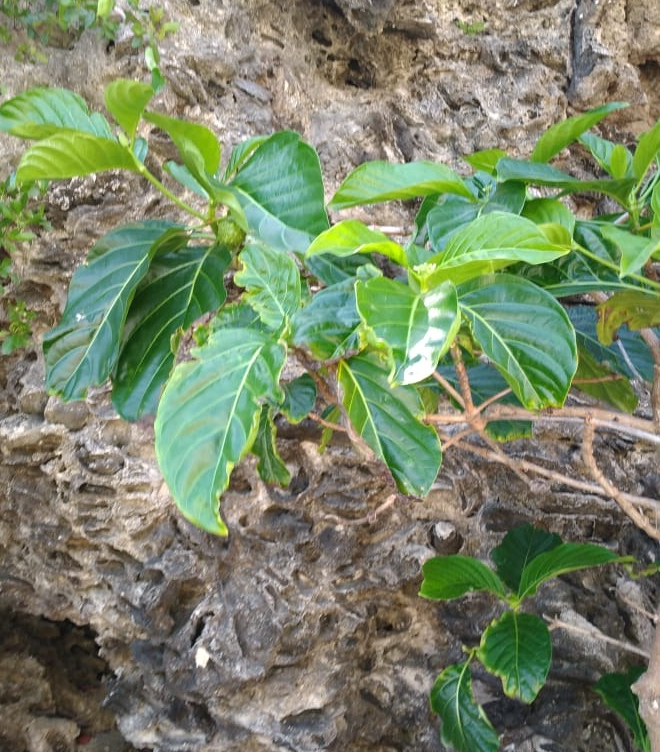

# Introducción

El mar constituye un elemento fundamental del conjunto de componentes de la superficie terrestre, capaz de generar cambios en las líneas de costas, sean estas en una isla o continente (referncia). De acuerdo con @suarez1999delimitacion, el termino costa se puede aludir a la franja de tierra que bordea el mar o a la zona de contacto entre el medio marino y el medio terrestre. Teniendo en cuenta que la línea de costa puede variar en un instante, o con el paso de los años, ya sea por la dinámica litoral o por causa de fenomenos naturales, que pueden traer como posible concecuencia la erosión o regresión de la costa [@kokot2004erosion;@codignotto1997geomorfologia].

Para @kokot2004erosion, la erosión costera es el resultado de un exceso de remoción de sedimentos respecto del aporte suministrado a un área determinada en un periodo específico. La misma abarca la emersión y sumersión de sedimentos en las orillas del mar o la playa, lo que mantiene en constante movimiento el límite exacto de la costa. Varios autores se han dedicado al análisis de línea de costa, usando como fuentes imágenes satelitales o fotografías áereas históricas. También se realizan observaciones y mediciones por un periodo de tiempo determinado que puedan dar respuesta a las causas de dicho cambio [@hernandez2008morfodinamica;@esquer2018modificacion;@cervantes2009variacion].

La costa como unidad geomorfológica se mantiene en constante estado de evolución. La importancia de conocer hacia dónde se desplaza más y qué forma ésta va adquiriendo, permite diferenciar el tipo de costa que, de acuerdo con @codignotto1997geomorfologia, puede clasificarse como: costa en progradación, costa estacionaria y costa en retrogradación. Del mismo modo, el autor hace énfasis en la importancia de comprender los factores que iniciden en este proceso y las causas que lo producen. Además de incluir posible formación geoquimica que se puede producir en la zona producto de estos cambios, como es el caso de la roca de playa. 

De acuerdo con @aliotta2009origen, las rocas o *beachrock* son formaciones sedimentológicas comunes que evidencian un proceso erosivo del litoral, los cuales se dieron lugar en un ambiente geoquímico que enmarcó un periodo de evolución continuo que pudo abarcar varias etapas del tiempo geológico. Dónde en tal proceso la arena pudo ser compactada por medio de cemento carbonático y al pasar varias épocas posiblemete afloraron. En la isla de Santo Domingo las formaciones arrecifales o rocas de playas datan del Neógeno y el periodo cuaternario. Ejemplo según @diaz2007memoria, la Fm. Isabela del pleistoceno; formación carbonatada arrecifal, rica en corales de tallas variables. Aflora bajo la forma de diferentes relieves, formando arrecifes en escalera descendiendo hacia el mar.

El litoral costero de la parte sur del país se caracteriza por pequeños acantilados, playas de origen aluvial y dunas extensas [@abreu1999impacto]. Además, mareas con oleajes extremos típico del mar caribe. No obstante, la ecología actúa como componente categórico en el microclima de una zona, resultado de la diversidad que ésta puede aportar. Por tal motivo, el interés de conocer el tipo de vegetación. Razón de que estos, sobre la arena son imprescindible para la conservación de los sedimentos, los cuales pueden desvanecerse a concecuencia de la erosión del viento y la lluvia [@d1985manglares].

De acuerdo con @camara1997republica, los litorales de la isla, se caracterizan por tener plantas propias de la especie árboreas o Rhizophoraceae como la morinda citrifolia (Noni), (ver figura \ref{noni}) y el mangle rojo  (ver figura \ref{manglerojo}). De igual modo la vegetación cercanas a aguas dulce o salada suele llamarse bosques de manglares, estos suelen encontrarse en algunas dunas costeras de la parte sur del país, principalmente en las riveras y desembocaduras de cuencas lacustre. Conforme @polania1998manejo, estos tipos de bosques son asociaciones vegetales que prosperan en las costas tropicales y subtropicales del mundo. Pero en la isla de Santo Domingo existe una tipología diferente en dichos espacios costeros.

La playa de Najayo se encuentra ubicada en la sección del mismo nombre, perteneciente al municipio San Gregorio de Nigua, provincia San Cristóbal, al Sur de la República Dominicana. Fisiográficamente, se ubica en la llanura costera del Caribe, en las coordenadas aproximadas 18º17'40" latitud Norte y 70º06'02" longitud Oeste. De acuerdo al mapa geológico de la isla de Santo Domingo [@abad2007mapageonizao], se estima que la formación del relieve costero de Najayo data de la era Cenozoica periodo Cuaternario entre las época Eoceno-Mioceno, el mismo está compuesto por arena y gravas bioclásticas formando el cordón litoral, además de conglomerado, gravas, arenas de fondo de valle, calizas arrecifales, calciruditas y calcarenitas (ver figura \ref{mapageo50k}).

\ldots

# Metodología

Para el análisis de cambio en la línea costera de la playa Carlos Pinto, ubicada en el paraje del mismo nombre en la sección Playa Najayo provincia San Cristóbal. Se utilizó como referencia de estudio imágenes satélitales de Landsat 5, 7 y 8, de los años (2013,2014,2015,2016,2017,2018,2019). Las cuales fueron delimitadas empleando el algoritmo de CoastSates que de acuerdo con @vos2019coastsat es un conjunto de herramientas de software de código abierto escrito en Python que permite al usuario obtener series de tiempo, pueden ser estos de 30 o más años, en cuanto a la posición de una costa sin importar que sea de tipo arenosa y a nivel mundial. Dicho software toma como base de datos imágenes satelitales disponibles al público. También se colectaron arenas y gravas en varios puntos de la costa, donde se llenó un formulario y se tomó las coordenadas geograficas de cada punto por medio de la aplicación ODK Collection descargada en un dispositivo móvil. Tales puntos fueron identificado por área con respecto al mar o la playa (Berma y Dunas de Playa), además de emplear los puntos cardinales para tal ubicación. Los clastos colectados fueron medidos en dos ejes (ancho y largo), de tal modo los resultados obtenidos fueron expresados en milímetros (mm) como unidad de medida. De igual manera se fotografió mediante la cámara de un teléfono móvil la vegetación y roca cercana a la costa.

\ldots

# Resultados

\ldots

# Discusión

# Agradecimientos

# Información de soporte

\ldots

# *Script* reproducible

\ldots

# Referencias
