# Introducción

El mar constituye un elemento fundamental del conjunto de componentes de la superficie terrestre, capaz de generar cambios en las líneas de costas, sean estas en una isla o continente de acuerdo con [@kokot2004vulnerabilidad]. Para @suarez1999delimitacion, el término costa puede aludir a la franja de tierra que bordea el mar o a la zona de contacto entre el medio marino y el medio terrestre. Teniendo en cuenta que la línea de costa puede variar en un instante, o con el paso de los años, ya sea por la dinámica litoral o por causa de fenomenos naturales, que pueden traer como posible concecuencia la erosión o regresión de la costa [@kokot2004erosion;@codignotto1997geomorfologia].

Para @kokot2004erosion, la erosión costera es el resultado de un exceso de remoción de sedimentos respecto del aporte suministrado a un área determinada en un periodo específico. La misma abarca la emersión y sumersión de sedimentos en las orillas del mar o la playa, lo que mantiene en constante movimiento el límite exacto de la costa. Varios autores se han dedicado al análisis de línea de costa, usando como fuentes imágenes satélitales o fotografías áereas históricas. También se realizan observaciones y mediciones por un periodo de tiempo determinado que puedan dar respuestas a las causas de dicho cambio [@hernandez2008morfodinamica;@esquer2018modificacion;@cervantes2009evidencia].

La costa como unidad geomorfológica se mantiene en constante estado de evolución. La importancia de conocer hacia dónde se desplaza más y qué forma ésta va adquiriendo, permite diferenciar el tipo de costa que, de acuerdo con @codignotto1997geomorfologia, puede clasificarse como: costa en progradación, costa estacionaria y costa en retrogradación. Del mismo modo, el autor hace énfasis en la importancia de comprender los factores que iniciden en este proceso y las causas que lo producen. Además de incluir posibles formaciones geoquimicas que se pueden producir en la zona producto de estos cambios, como es el caso de la roca de playa. 

De acuerdo con @aliotta2009origen, las rocas o *beachrock* son formaciones sedimentológicas comunes que evidencian un proceso erosivo del litoral, los cuales se dieron lugar en un ambiente geoquímico que enmarcó un periodo de evolución continua que pudo abarcar varias etapas del tiempo geológico. Es posible que durante ese proceso la arena de la playa compactara por medio de cemento carbonático y al pasar varias épocas posiblemete afloraron. En la isla de Santo Domingo las formaciones arrecifales o rocas de playas datan del Neógeno y el periodo cuaternario. Ejemplo de ella según @maparecursosminerales, la Fm. Isabela del pleistoceno; formación carbonatada arrecifal, rica en corales de tallas variables. Aflora bajo la forma de diferentes relieves, formando arrecifes en escalera descendiendo hacia el mar (ver figura \ref{beachrock_foto}).

El litoral costero de la parte sur del país se caracteriza por pequeños acantilados, playas de origen aluvial y dunas extensas [@abreu1999impacto]. Además, mareas con oleajes extremos típico del mar caribe. No obstante, la ecología actúa como componente categórico en el microclima de una zona, resultado de la diversidad que ésta puede aportar. Por tal motivo, el interés de conocer el tipo de vegetación. Razón de que estos, sobre la arena son imprescindible para la conservación de los sedimentos, los cuales pueden desvanecerse a concecuencia de la erosión del viento y la lluvia [@d1985manglares].

De acuerdo con @camara1997republica, los litorales de la isla, se caracterizan por tener plantas propias de la familia Polygonaceae o Rhizophoraceae como la cocoloba_uvífera (uva de playa) (ver figura \ref{cocoloba}) y el mangle rojo  (ver figura \ref{manglerojo}). De igual modo la vegetación cercanas a aguas dulce o salada suele llamarse bosques de manglares, estos suelen encontrarse en algunas dunas costeras de la parte sur del país, principalmente en las riveras y desembocaduras de cuencas lacustre. Conforme @polania1998manejo, estos tipos de bosques son asociaciones vegetales que prosperan en las costas tropicales y subtropicales del mundo. Pero en la isla de Santo Domingo existe una tipología diferente en dichos espacios costeros.

{height=280px}

{height=320px}

{height=400px}

La playa de Najayo se encuentra ubicada en la sección del mismo nombre, perteneciente al municipio San Gregorio de Nigua, provincia San Cristóbal, al Sur de la República Dominicana. Fisiográficamente, se ubica en la llanura costera del Caribe, en las coordenadas aproximadas 18º17'40" latitud Norte y 70º06'02" longitud Oeste. De acuerdo al mapa geológico de la isla de Santo Domingo [@abad2007mapageonizao], se estima que la formación del relieve costero de Najayo data de la era Cenozoica periodo Cuaternario entre las época Eoceno-Mioceno, el mismo está compuesto por arena y gravas bioclásticas formando el cordón litoral, además de conglomerado, gravas, arenas de fondo de valle, calizas arrecifales, calciruditas y calcarenitas (ver figura \ref{mapageo50k}).

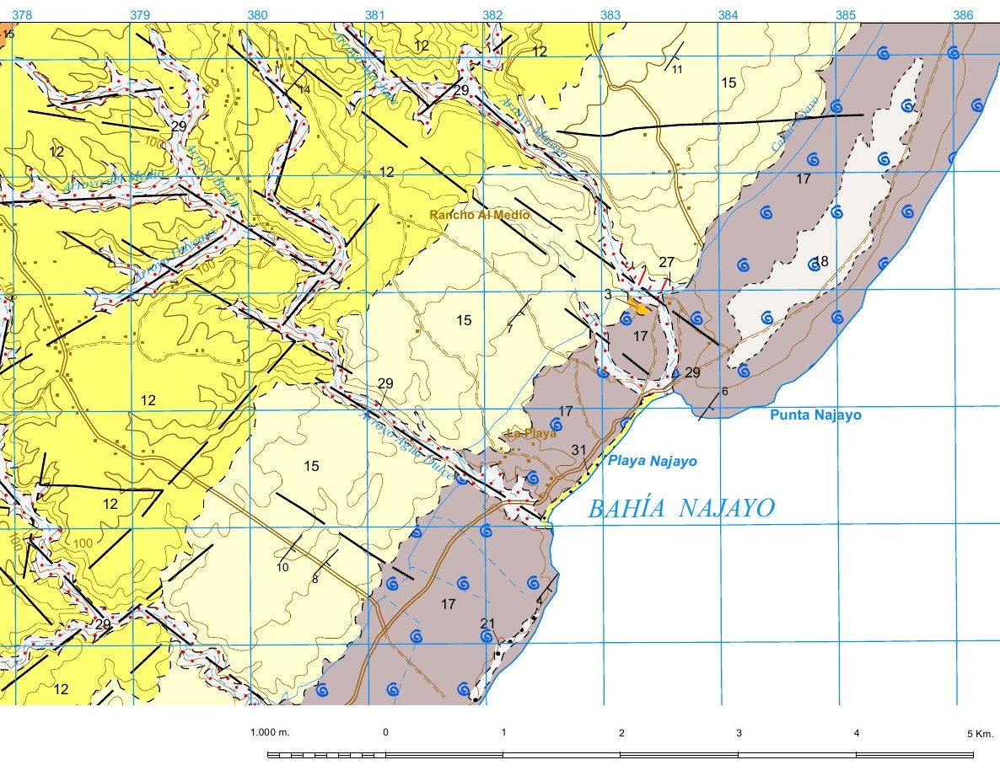

Este estudio tiene como objetivo contribuir al conocimiento de la dinámica y geomorfología litoral domininicana, utilizando como estudio de caso la playa de Najayo. En particular, este estudio plantea identificar cambios en el trazado de la línea de costa, en qué lugares y época del año comúnmente se producen y a qué factores se atribuyen. Igualmente, analizar la granulometría de los depósitos de playa, así como explorar su variabilidad y proponer factores explicativos. Además, determinar las causas que originaron el *beachrock* situado en el centro de la playa. Finalmente, examinar el perfil de playa mediante técnicas fotogramétricas y navegación por satélite. La importancia del presente estudio consiste en que aporta nuevo conocimiento sobre la playa de Najayo y su dinámica, y porque tiene potencial para informar medidas de gestión de este importante recurso natural.   

# Metodología


Para alcanzar los objetivos se emplearon varias técnicas, entre las que se incluyen fotogrametría, navegación por satélite, teledetección, sistemas de información geográfica y estadística. Por consiguiente, cada técnica empleada generó una serie de resultados que pertimitieron el desarrollo de la investigación y la producción de informaciones. 

Los cambios en el trazado de las líneas de costa se analizaron utilizando  imágenes satelitales de Landsat 8 adquiridas entre los años 2013 y 2019. De cada escena se extrajo la línea de costa empleando el algoritmo CoastSat, el cual es un conjunto de herramientas escritas en Python, que permite al usuario obtener series de tiempo de la posición de la costa [@kilian_vos_2019_3560436]. 

Al delimitar las líneas de la costa, posteriormente se utilizó la aplicación [@qgis2015qgis] donde se seleccionaron los trazados de mayor precisión teniendo como referencia la línea más antigua (2013), dentro de dicho entorno gráfico se digitalizaron 25 transectos perpendiculares a la dirección general del diseño. Finalmente, tanto los transectos como las líneas fueron analizadas en R utilizando el script RCoastSat [@jose_ramon_martinez_batlle_2020_3937481;@r2020r], el cual produjo resultados gráficos que facilitaron la interpretación.

Asimismo, se colectaron siete muestras de sedimentos, que incluyeron tanto arenas como gravas, los cuáles fueron seleccionados en base a tres áreas con respecto al mar (canal,berma y duna de playa) e identificadas con un código de lugar (ver figura \ref{muestras}). Dichas muestras fueron depositadas en bolsas Whirl Pak de 23 cm L x 11.5 cm W, con 0.064 mm de grosor y 532 ml de capacidad. También, se tomaron las coordenadas de cada punto con el receptor GPS convencional del telefono móvil y se midieron los clastos (en milímetros) presentes con una regla en dos ejes largo y ancho. Estos datos fueron rellenados en un formulario electrónico para cada muestra, utilizando la aplicación ODK Collection [@singh2013mobile] descargada en el teléfono. Además, se extrajo por medio de un martillo un fragmento del *beachrock* (ver figura \ref{clasto}) al cuál se le aplicó ácido clorhídrico para determinar si contenía carbonato. Finalmente, para tener datos recientes del perfil de la playa, se realizó un vuelo de dron y se tomaron fotografias de la zona.

Se tomaron 136 fotografías aéreas verticales con un drone, de las cuales 58 se adquirieron en la playa de Carlos Pinto (extremo sudoccidental) y 78 en la de Los Pescadores (extremo nororiental). Estas fotografías se posprocesaron utilizando OpenDroneMap, para generar modelos digitales de superficie (DSM, por sus siglas en inglés) y ortofotografías. Los DSM fueron empleados en la extracción de perfiles topográficos de la playa por medio de transectos utilizando el el script de ayuda BeachProfile [@jose_ramon_martinez_batlle_2020_3938999], y las ortofotografías se emplearon para evaluar el aspecto general de la playa (ver figura \ref{carlo}). El script BeachProfile genera perfiles de playa de forma dimensional con una misma o diferentes escalas, al igual que la concavidad que muestra cada una .


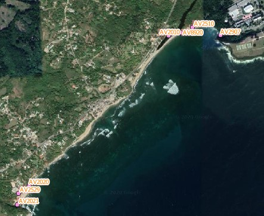{height=300px}

{height=300px}

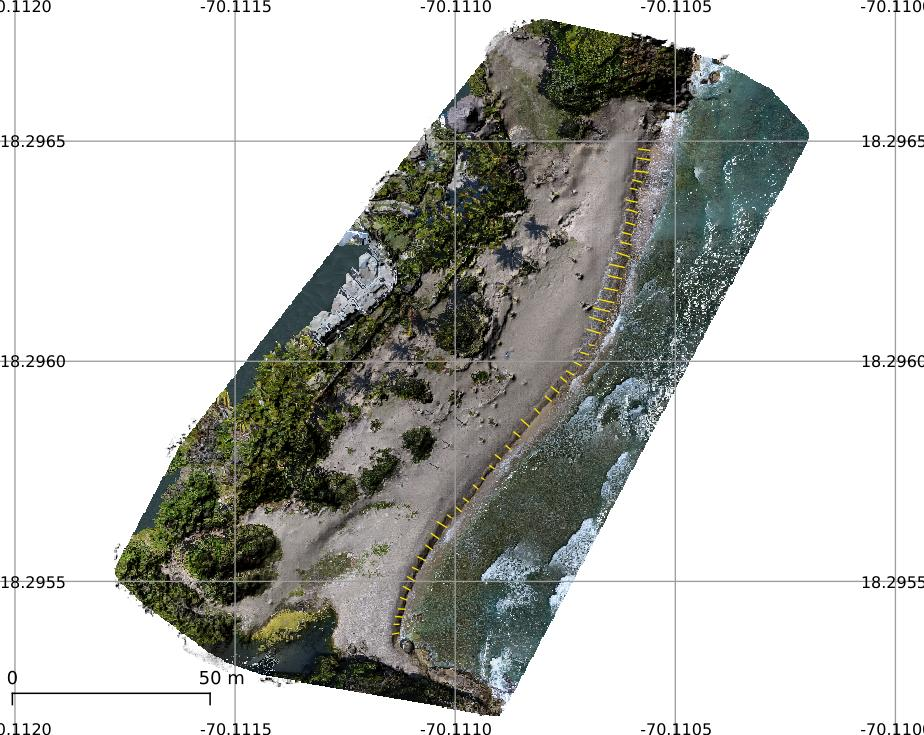{height=325px}


# Resultados


Los resultados generados se agrupan en tres subconjuntos: compilación de trazados en la líneas de costa, análisis granulométrico y las formaciones de rocas en el centro de la playa, además de la restitución fotogramétrica para la obtención de información tridimensional. 


## Cambios de la líneas de costa


Los trazados de las líneas de costa y los 25 transectos permitieron reconstruir una serie de temporal de la dinámica del litoral de Najayo (ver figura \ref{lineas}). Estos transectos muestran un esquema del cambio de la costa por trimestre de cada año (ver figura \ref{cambio}). También se identificaron los sectores de la playa más susceptibles al cambio y las épocas del año de mayor actividad (ver figura \ref{resultados}). De manera global, los cambios más prominentes ocurrieron en el tercer cuatrimestre (septiembre-diciembre) de cada año, en los que comúnmente predominó la progradación en casi todos los años. Por el contrario, durante los meses de junio a agosto, se registró una dinámica predominante de retrogradación.


En cuanto al perfil de playa, las pendientes generadas de manera dimensional presentaron inclinaciones y a escalas diferentes en varios transectos, a medidas en que avanzaba al extremo occidental (ver figura \ref{dimension}). Por consiguiente, el declive más bajo estuvo en los espacios del 1 hasta el 10 con medidas desde -6.3º y -14.11º, el alto desde el 41 al 48 con -11.78º y -19.99º apróximadamente (ver figura \ref{alta} y \ref{baja}). En relación con el índice de concavidad, ésta mostró un perfil cóncavo con inclinaciones de poco más de -0.01º y menos de -0.51º (ver figura \ref{indice} y \ref{concavo}).


## Análisis granulométrico


El tamaño de los sedimentos presentó variaciones en cada punto de muestreo (ver figura \ref{estadistico}), donde se resumen los estadísticos y tamaños de muestra en cada una de las localidades de colecta (ver figura \ref{grafico} y \ref{lugar}). La playa de los Pescadores registró los valores extremos, tanto de ancho como de largo de los clastos. Por otra parte, en las muestras de Carlos Pinto, los clastos fueron más largos en promedio que en la otra playa.


En los diagramas de caja y en los histogramas se observa que las muestras presentan sesgos hacia la derecha o positivo en ambas playas (ver figura \ref{largo} y \ref{ancho}). Adicionalmente, se identificó la distribución por cuartiles de las mediciones según playa (ver figura \ref{playa}). En la playa los Pescadores el 25% más pequeño de los clastos alcanzó 10 mm de largo y 7 mm de ancho, la mediana (el valor que mide la muestra en dos partes iguales) fue de 13 mm y 10 mm para el largo y el ancho respectivamente, mientras que el tercer cuartil, es decir el  75% más pequeño de los clastos medidos tenía 15 mm o menos de largo y 12 mm de ancho. En tanto que, en Carlos Pinto la mediana fue de 15 mm y 9 mm de largo y ancho respectivamente y el primer cuartil de 13 mm de largo y 8 mm de largo aproximadamente.


## Rocas de playa


Las rocas emergidas y submergidas en la playa de Carlos Pinto se ubican en el centro de la costa. Estas afloran someramente en pequeños bancos de la playa, excepto las que se encuentran cerca a los pequeños acantilados. Se extienden desde la superficie terrestre hacia el mar, principalmente desde la desembocadura de dos cañadas, ésta se define como cuerpo de agua de curso temporero que circula sobre la superficie y desemboca en otra masa de agua sea dulce o salada.

 
{height=300px}

La línea de color negro representa el trazado de referencia, el cual fue extraído de la imágen satélital del año 2013. Los transectos de color amarillo representan la superficie terrestre en tanto que los de azul el mar.

{height=800px}

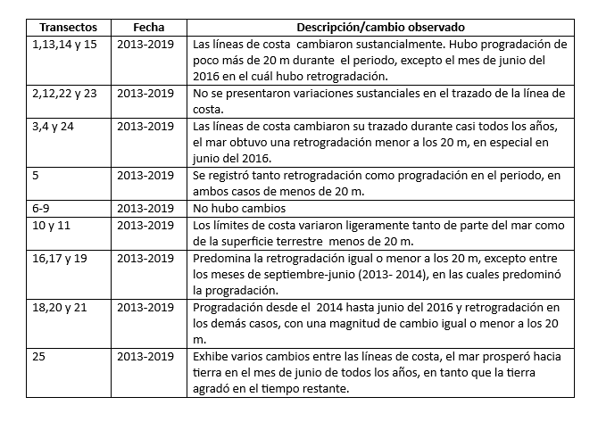{height=275px}

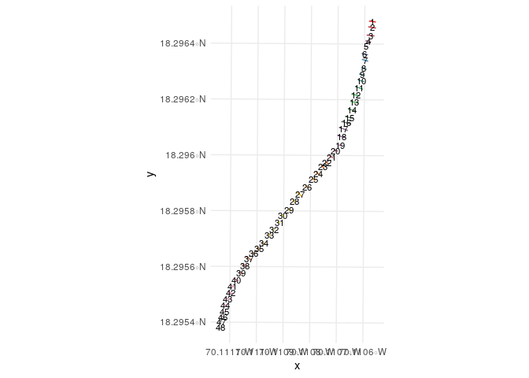{height=400px}

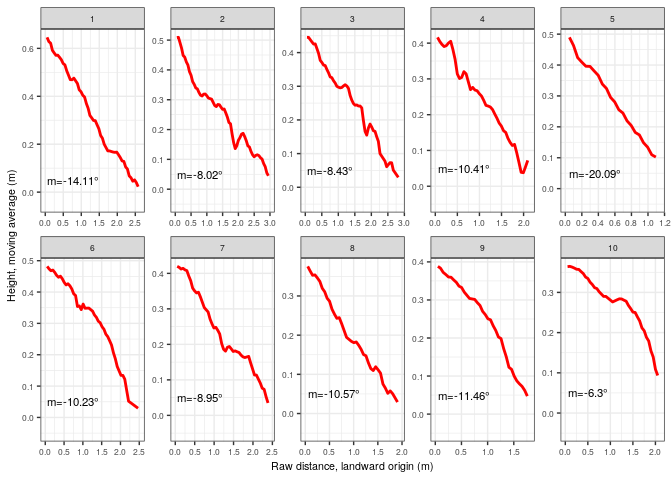{height=300px}

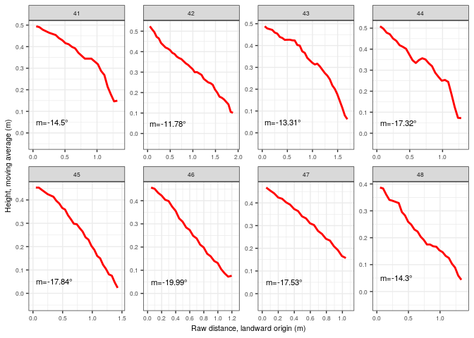{height=300px}

{height=300px}

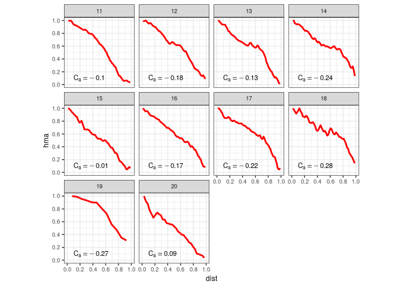{height=300px}

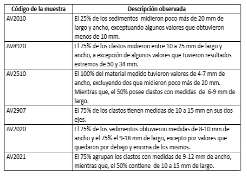{height=250px}

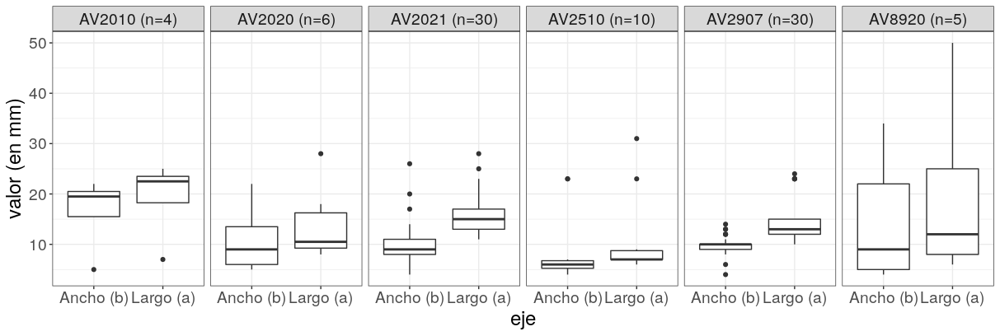

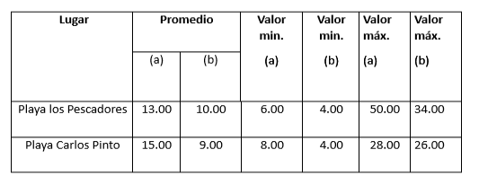{height=250px}

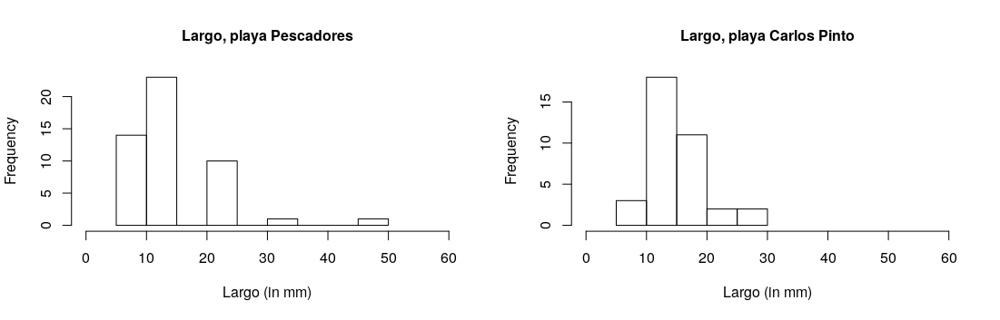

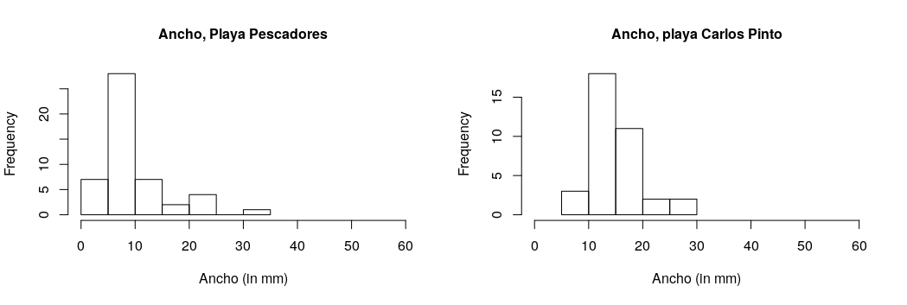

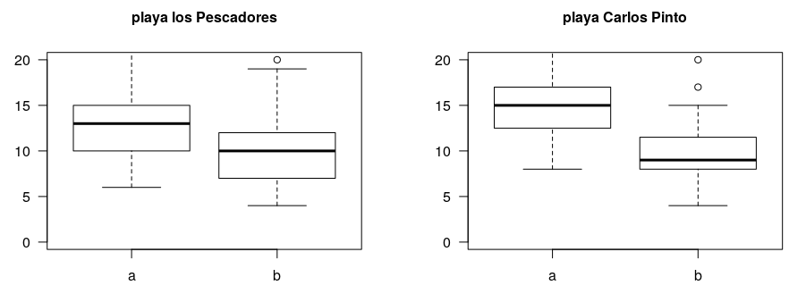


# Discusión

Los cambios en la costa se les pueden atribuir a diferentes fenómenos que pueden dejar concecuencias de aspecto temporales o permanentementes en un espacio determinado. Por lo cual, es factible identificar las variaciones en los trazados de las líneas, los lugares vulnerables y en qué épocas de cada año se reflejaron. De igual modo, examinar la granulometría de la zona, el perfil que proyecta la playa, además de la formación de las rocas en áreas específicas y así encontrar factores explicativos a cada uno de estos hechos. De acuerdo con [@dominguez2004tasas], los cambios costeros serán responsables por factores geomorfológicos y dinámicos de índole local, así como regional que darán variaciones de manera temporal afectando zonas, generado por periodos erosivos concentrados en el tiempo (días, semanas).


## Cambio en líneas de costa


Los cambios presentados en las líneas de costa y en épocas específicas, probablemente sean producto en su momento de fenómenos atmosféricos (tormentas/huracanes). De acuerdo con @dominguez2004tasas, estos fenómenos originan fuertes oleajes que modifican la playa en un periodo determinado. Ésto, haciendo referencia de que el trimestre junio a septiembre de todos los años presentaron variaciones todos los trazados, donde predominó la retrogradación. Exceptuando, la temporada del 2016 que fue la que más cambios mostró superando los 20 m de distancia. Posiblemetente, por el paso del huracán Mathews (catégoria tres), el cuál se encontraba al suroeste de Santo Domingo de acuerdo a un periodico de circulación nacional. Además, esos cambios fueron relevantes en áreas específicas de la costa, por ejemplo, la Playa de Carlos Pinto fue más propensa en mostrar alteraciones. Quizas, por la dirección de los vientos y la corriente marina que van erosionando la morfología del litoral. Según @dominguez2004tasas, el viento y el oleaje provocan concentración o disipan energía, los cuales determinarán mayor o menor erosión o incluso sedimentación.

Por otra parte, la playa presentó un perfil cóncavo donde la pendiente tomó altura a medida que se acercaba a la desembocadora del arroyo Agua Dulce al extremo occidental. Estas características se le puede atribuir a la erosión causada por el oleaje, al viento y la corriente marina que de acuerdo con [@lorenzo2003evolucion], la deriva litoral es la causante de este proceso y él mismo puede ser diferente durante cada estación del año.   


## Análisis granulométrico

 
Las variaciones en los tamaños presentados de los depósitos de sedimentos en la playa de Najayo probablemente sean inusuales. En el caso de la playa los Pescadores que posee los valores más extremos en cuanto a largo y ancho, se deba a la dinámica de transporte de sedimento existente en la zona. Puesto que, el arroyo Rolón mantiene su recorrido (de forma lenta) hacia el mar, sedimentando la costa constantemente. En relación con Carlos Pinto que obtuvo el promedio más largo y ancho, el cuál se le pude atribuir al flujo de material arrastrado por el arroyo Agua Dulce en su tiempo de caudal. De acuerdo con @kokot2004erosion las aguas continentales son las principales fuentes de aportación sedimentaria en la costa y los mismos son originarios en periodos donde las condiciones climáticas eran diferentes de las actuales. De ahí, las diferencias en los clastos, además de el tamaño de la cuenca que en el caso de Agua Dulce es de menor dimensión que el Rolón. también, por fenómenos naturales, razón de que en ese tiempo el mar excede su límite y lanza escombro en toda la ensenada.


## *Beachrock*

Las rocas de playa se encuentran ubicadas en el espacio por el cuál cañadas vierten sus aguas al mar, extendiéndose hacia el centro de la costa. Posiblemente, éstas se formaron por la compactación de la arena con el carbonato de calcio, es factible que en éste proceso de fosilización el agua continental circulara de manera superficial por rocas calizas arrecifales. El *beachrock* presenta rocas alteradas de basaltos, fósiles y tonalidas las cuales probablemente emanaron del continente y eventualmente llevadas hasta ese lugar por la deriva continental, por la cañada que desemboca en el mar o por un arroyo/río que tal vez hoy ya no transita en el lugar.

# Agradecimientos


Expresamos nuestro agradecimiento a la Universidad Autónoma de Santo Domingo (UASD), en especial a la escuela de geografía por su deseo de formar profesionales capaces de desarrollar habilidades críticas fomentada en la investigación. También, al profesor José Ramón Martínez Batlle por facilitar todas las herramientas de obteción de datos, por su siempre disposición, ayuda e insistir en la importancia de los estudios de investigación científica para la generación de conocimiento y desarrollo de los pueblos. Por último, a Carolaine Pérez Ureña por unirse a este tema y así generar información sobre el litoral a favor de la sección Playa Najayo la cuál es escasa.


# Información de soporte


# *Script* reproducible


## Packages

```{r, warning=F, message=F}
library(tidyverse)
library(purrr)
library(sf)
library(RColorBrewer)
```


## Read the functions

```{r, results='hide'}
basegeofispath <- 'https://raw.githubusercontent.com/geofis/RCoastSat/master/R/'
scripts <- c('classify-transects.R', 'extract-points-distances.R',
             'interpolate.R', 'read-shorelines.R', 'read-transects.R')
invisible(purrr::map(paste0(basegeofispath, scripts), function(x) devtools::source_url(x)))
```

## Import/plot transects and shorelines

```{r}
shl <- rshl('data/najayo-l8-shorelines.geojson') %>% mutate(
  date=as.Date(date)) #Shorelines
refl <- shl %>% filter(date==min(date
                                 )) #Reference shoreline
rawtrans <- rtrans('transectos_lineacosta.geojson') #Raw transects
trans <- transclas(tr = rawtrans, rl = refl
                   ) #Transects classified by seaward/landward sections
cols <- colorRampPalette(brewer.pal(9,'Set1'))(nrow(shl))
ggplot() +
  geom_sf(data = shl %>% mutate(date = factor(date)), 
          color = cols) +
  geom_sf(
    data = refl %>% mutate(linetype = paste0('Ref. (', date, ')')),
    aes(color=linetype), lwd = 1, show.legend = 
      'line') +
  geom_sf(
    data = trans %>% mutate(sealand=paste0('Transect: ', sealand)),
    aes(color = sealand), show.legend = 'line', lwd = 1) +
  scale_color_manual(
    values = c('black', 'orange', 'blue')) +
  geom_sf_text(
    data = trans %>% filter(sealand=='landward') %>%
      st_centroid, aes(label = transect),
    size = 4) +
  theme_minimal() +
  theme(legend.title = element_blank())
```

## Extract points at interserctions and calculate distances

```{r}
distl <- pointdist(sh = shl, re = refl, tr = trans, rtr = rawtrans)
```

## Time-series of shoreline change for each transect 

```{r, fig.height=20}
interdist <- map(distl, interpolate) %>% plyr::ldply()
distances <- plyr::ldply(distl)
distances %>% 
  ggplot() + theme_bw() + aes(x = date, y = distance_sign) +
  geom_ribbon(data = interdist, aes(ymax = pmax(distance_sign,
                                                0), ymin = 0), fill = "sienna3") +
  geom_ribbon(data = interdist, 
              aes(ymin = pmin(distance_sign, 0), ymax = 0), fill = "skyblue3") +
  geom_hline(yintercept = 0, color = 'grey') +
  geom_line(colour='black', lwd = 0.5) +
  scale_x_date(labels = scales::date_format("%Y-%m"), 
               date_breaks = '3 months') +
  scale_y_continuous(limits = c(-30, 30)) +
  theme(axis.text.x = element_text(angle = 90, vjust = 0.5
                                   ), text = element_text(size = 14)) +
  facet_wrap(~transect, ncol = 1)
```

# Análisis granulométrico

```{r}
library(jsonlite)
library(tidyverse)
df <- jsonlite::fromJSON('Cantometría_3_results.json', flatten = TRUE)
df  %>% filter(!codigomuestra %in% c('C20190726M1', 'C20191028M1'
                               )) %>% unnest(clastos) %>%
  select(`Codigo de lugar`=codigomuestra, `Largo (a)`=a,
         `Ancho (b)`=b) %>%
  group_by(`Codigo de lugar`) %>%
  mutate('Codigo de lugar n'=paste0(`Codigo de lugar`,
                           ' (n=', length(`Codigo de lugar`),')')) %>%
  ungroup() %>% select(-`Codigo de lugar`
                       ) %>% gather(eje,
                    `valor (en mm)`, -`Codigo de lugar n`) %>%
  ggplot() + aes(x = eje, y = `valor (en mm)`) + geom_boxplot() +
  facet_grid(~`Codigo de lugar n`) + theme_bw() +
  theme(text = element_text(size = 9))
df2 <- df %>% filter(!codigomuestra %in% c('C20190726M1',
                      'C20191028M1')) %>% unnest(clastos)

playa_pescadores <- droplevels(df2[df2$codigomuestra %in% c(
  "AV2010","AV8920","AV2907","AV2510"), c("a","b")])

playa_carlos_pinto <- droplevels(
  df2[df2$codigomuestra %in% c("AV2021","AV2020"), c("a","b")])

par(mfrow=c(1,2))

boxplot(playa_pescadores, las = 1, main = 'playa los Pescadores', 
        cex.main = 1, ylim = c(0,20))

boxplot(playa_carlos_pinto, las = 1, main = 'playa Carlos Pinto',
        cex.main = 1, ylim = c(0,20))

hist(playa_pescadores$a, xlim = c(0,200), main = 'Largo, playa Pescadores',
     xlab = 'Largo (in mm)', cex.main = 1)

hist(playa_carlos_pinto$a, xlim = c(0,200), main = 'Largo, playa Carlos Pinto',
     xlab = 'Largo (in mm)', cex.main = 1)

hist(playa_pescadores$b, xlim = c(0,200), main = 'Ancho, Playa pescadores',
     xlab = 'Ancho (in mm)', cex.main = 1)

hist(playa_carlos_pinto$a, xlim = c(0,200), main = 'Ancho, playa Carlos Pinto',
     xlab = 'Ancho (in mm)', cex.main = 1)

```

# Referencias
